# 深度学习笔记
`Notes during my learning DL`

学习视频我看的是：[2022吴恩达机器学习Deeplearning.ai课程](https://www.bilibili.com/video/BV1Pa411X76s/?p=43&spm_id_from=pageDriver&vd_source=72cbed57f84134f653cd0ebd0e4e2cff)

- [深度学习笔记](#深度学习笔记)
  - [AI的分类](#ai的分类)
  - [神经网络术语：](#神经网络术语)
  - [神经网络用于面部识别](#神经网络用于面部识别)
  - [神经网络中的网络层](#神经网络中的网络层)
  - [前向传播算法(Forward propagation algorithm)](#前向传播算法forward-propagation-algorithm)
  - [TensorFlow](#tensorflow)
  - [向量化神经网络前向传播的代码实现](#向量化神经网络前向传播的代码实现)
  - [用TensorFlow训练神经网络(感知层)](#用tensorflow训练神经网络感知层)
  - [其他类型的激活函数](#其他类型的激活函数)
    - [**输出层**激活函数的选择](#输出层激活函数的选择)
    - [**隐藏层**激活函数的选择](#隐藏层激活函数的选择)
  - [**多分类问题**(Multi-class classification)](#多分类问题multi-class-classification)
    - [**Softmax算法**：针对多分类环境的二元分类算法](#softmax算法针对多分类环境的二元分类算法)
    - [**Softmax激活函数**](#softmax激活函数)
  - [多标签分类问题(Multi-label classification)](#多标签分类问题multi-label-classification)
  - [高级优化算法Adam(Adaptive Moment estimation)](#高级优化算法adamadaptive-moment-estimation)
  - [卷积层(Convolutional Layer)](#卷积层convolutional-layer)


***
## AI的分类
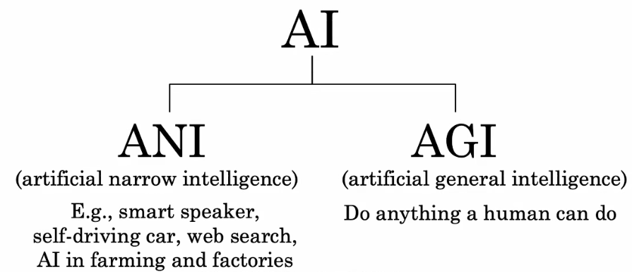  
ANI：简单的AI系统，一般只做一件事或一狭隘的任务，有时能达到非常好的效果，比如智能音箱，自动驾驶或者网页搜索

AGI：能够完成一般人能做的所有事情的AI系统

神经网络术语：
---
- 输入层(Input layer): 输入神经网络用于训练的数据特征,也被称为第0层。
- 输出层(Output layer):输出的值即为神经网络预测的结果
- 隐藏层(Hidden layer): 中间层，大多不止一个
- 激活(Activations):负担能力意识和感知质量。
- 激活值(Activation values)


## 神经网络用于面部识别
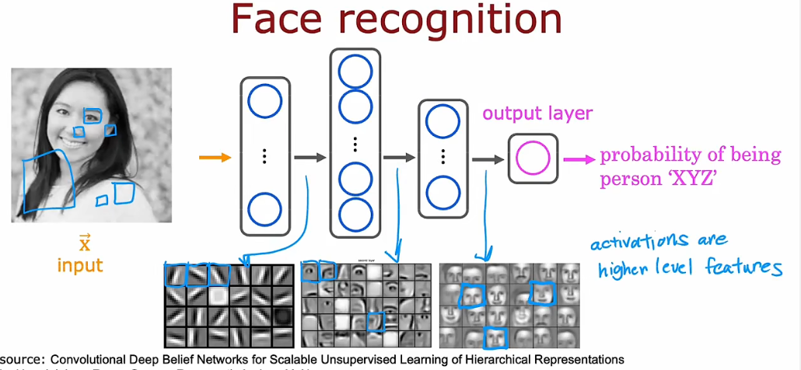
1. 第一个隐藏层中的神经元主要寻找垂直线边缘
2. 第二个隐藏层中的神经元则是在寻找有方向的线或者边
3. 第三个隐藏层中的神经元在这个方向上寻找一条线，依次类推...
>在较早的隐藏层中的神经元在图中寻找非常短的线条或非常短的边缘
4. 再往后的神经元将这些短线条聚集在一起，形成很多短小的线条和边缘段，从而好寻找脸的一部分
5. 神经元将人脸的不同部分聚合在一起，然后检测图像中是否存在粗粒度更大的面部轮廓
6. 最后检测这张脸与不同面部轮廓的符合程度，创建一组丰富的特征，然后帮助输出层确定图片中人物的身份
>不同层的神经元分析的实际上可以对应于图像中不同大小的区域

## 神经网络中的网络层
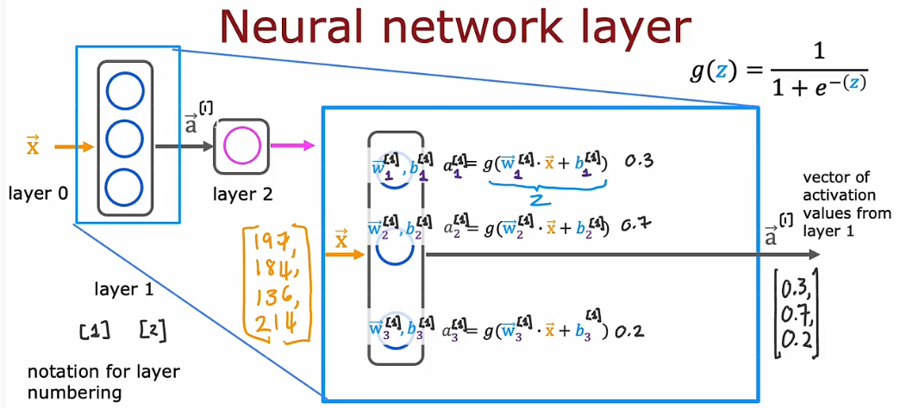
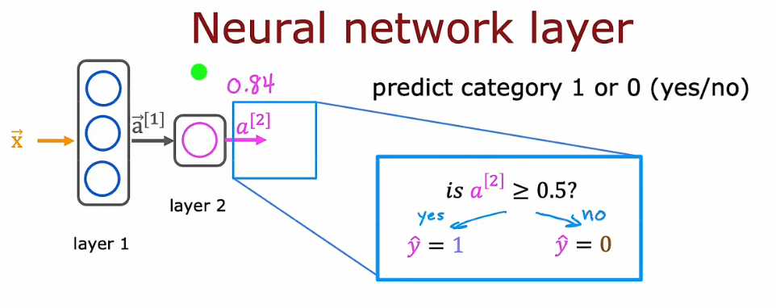

>要注意在比较复杂的神经元之间计算时角标和矢量
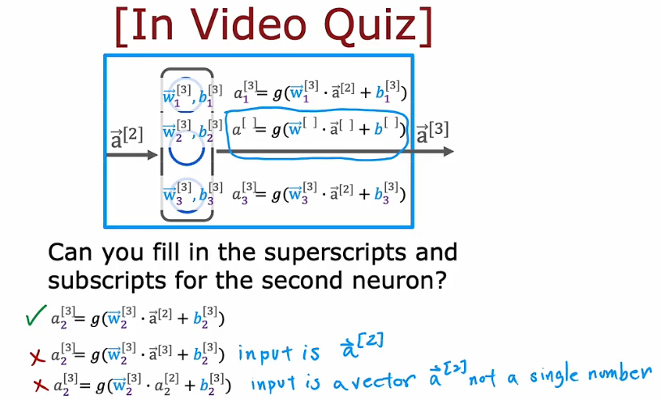
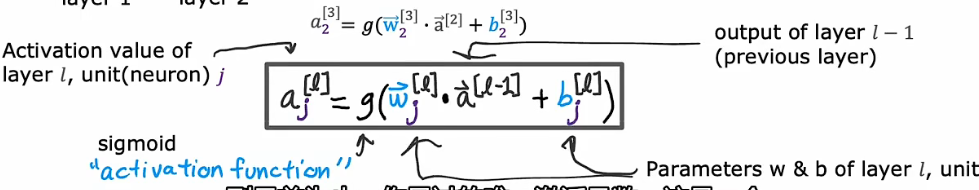  
**上角标是神经网络的层数，下角标是该层神经元的序号**
## 前向传播算法(Forward propagation algorithm)

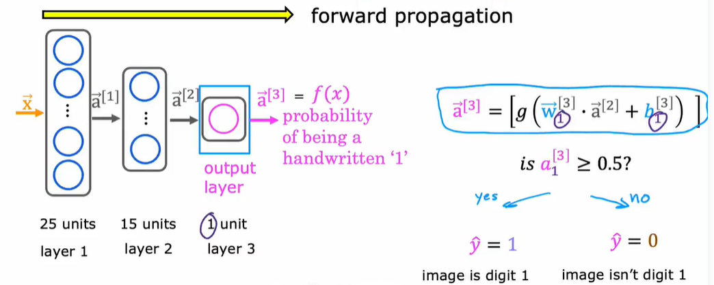

要传播神经元的激活值，计算是从左往右进行，

## TensorFlow
- 示例1 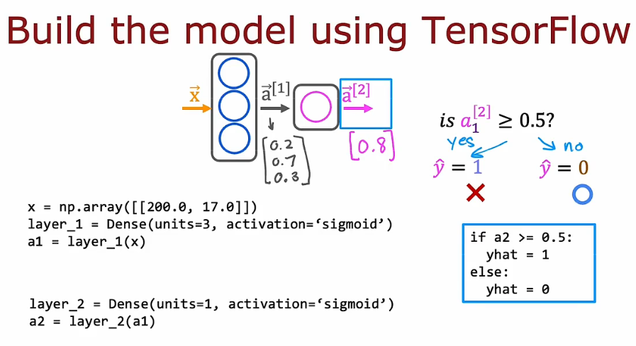

- 示例2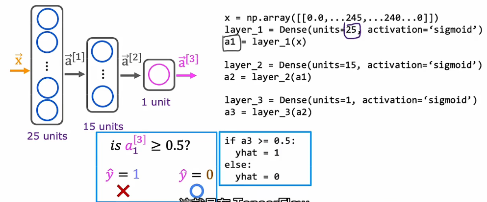

> - Dense是神经网络一种名字
> - unit参数是该层神经元的个数
> - 在TensorFlow中矩阵(张量tensor)的表示用 `np.array([[ ]])`两个大括号来表示
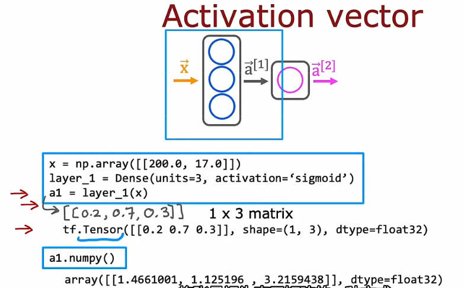

TensorFlow中的`Sequential()`函数可以将建立的两个神经层串联在一起，用TensorFlow可以大大简化代码

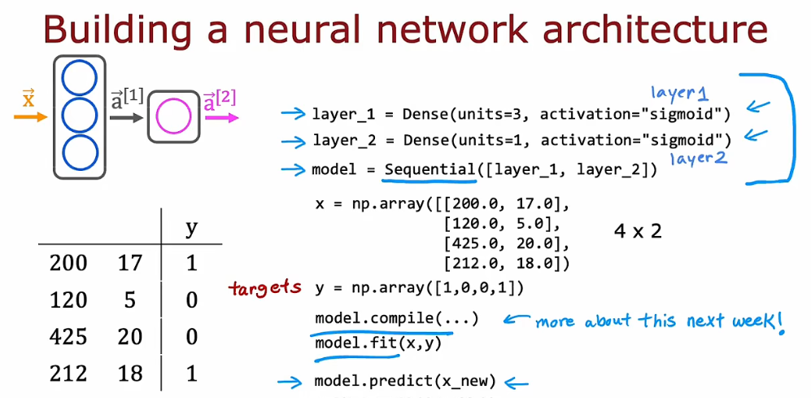  
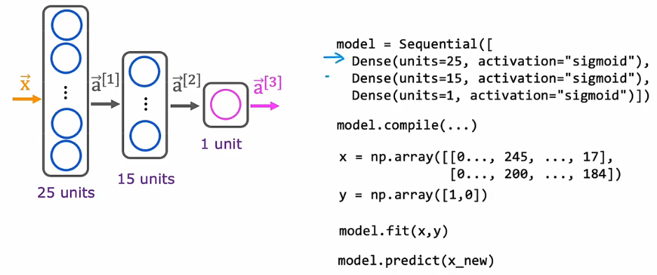  

对应的实验室为：[TensorFlow](Advanced_Learning_Algorithms/week1/5.TensorFlow%20implementation/C2_W1_Lab02_CoffeeRoasting_TF.ipynb)

**关于神经网络一些比较核心代码的思路**： 
在NumPy中实现前向传播时dense()函数的写法
```python
def dense(a_in,W,b,g)∶
  units = W.shape[1]
  a_out = np.zeros(units)
  for j in range(units):
    w= W[:,j]    #提取矩阵的第j列，矩阵用大写字母表示，小写表示向量或标量
    z = np.dot(w,a_in) + b[j]
    a_out[j] =g(z)
  return a_out
```
一个四层神经网络的写法： 
```python
def sequential(x):
  a1 = dense(x，W1,b1)
  a2 = dense(a1, W2，b2)
  a3 = dense(a2，W3，b3) 
  a4 = dense( a3,W4，b4)
  f_x = a4
return f_x
```
## 向量化神经网络前向传播的代码实现

**向量化(vectorized implementation)神经网络前向传播(forward prop in a neural network)的代码实现**
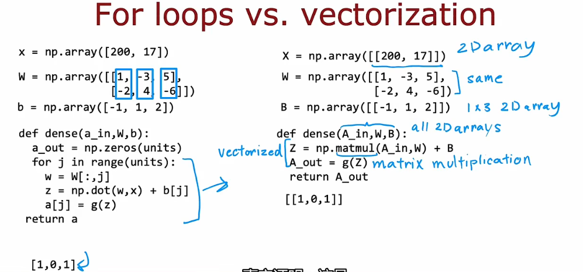  

关于向量、矩阵点乘知识的复习
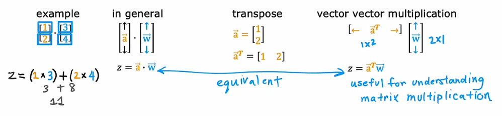   
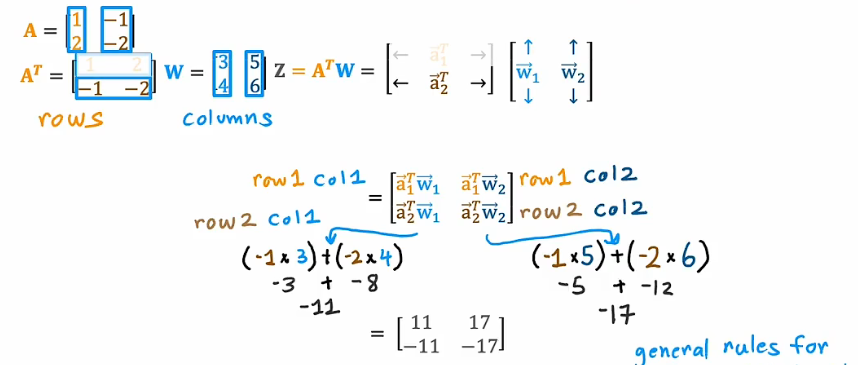  

---
代码中实现点乘

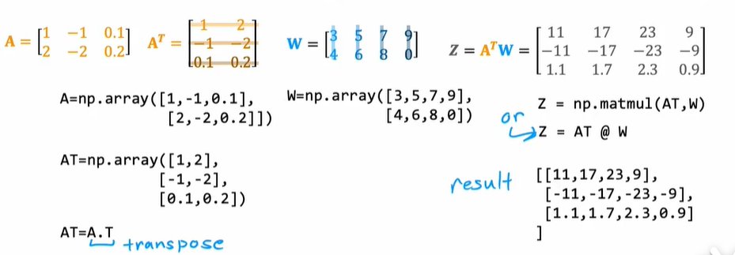  

`Z = np.matmul(AT,W)`
> AT @ W 的写法中@相当于是调用matmul函数，但是一般不这么写，知道即可

```python
AT = np. array ([[200，17]])  #在TensorFlow中XT称为AT
W = np. array([[1,-3，5],
             [-2，4，-6]])
b = np.array([[-1，1，2]])

def dense(AT,W,b,g):   #此处AT一般称为a_in
  z = np.matmul(AT,w) + b
  a_out = g(z)
  return a_out   #[[1,0,1]] 
```

## 用TensorFlow训练神经网络(感知层)
 
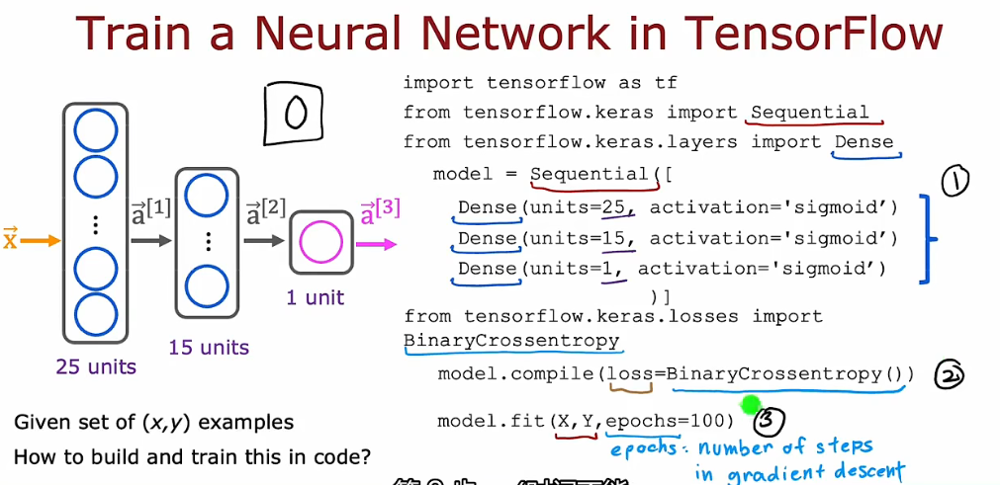  
>代码流程
>1. 建立逻辑回归模型，在给定输入特征x，参数W和b的情况下，告诉TensorFlow如何计算推断
>2. 编译模型，指定损失函数loss function(此处用到的是稀疏分类交叉熵 BinaryCrossentropy)和成本函数cost function
>3. 训练模型,用具体的梯度下降算法来最小化成本函数J(W,b),这里调用的fit函数中实现了反向传播算法(计算梯度下降中的偏导数项)
> 
>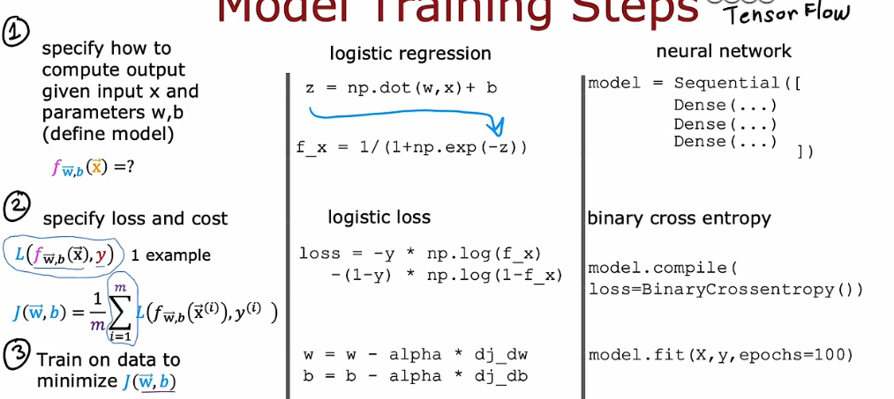  

>逻辑回归问题中最后一层选用线性回归函数并改变loss函数的设置可以提高计算精度。具体原因和方法见[softmax激活函数](#softmax激活函数)
## 其他类型的激活函数
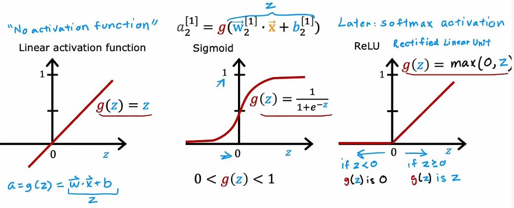 

### **输出层**激活函数的选择

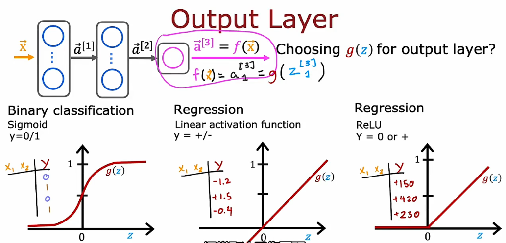   
在输出层，不同激活函数选择的依据主要是输出y的属性
- **sigmoid**
  适合处理二(元)分类(binary classification)的问题，因为这样神经网络学会了预测y=1的概率，就像逻辑回归一样  
  代码中实现：`activation='sigmoid'`
- **ReLU** (Rectified linear unit 代表的是修正线性单元)
  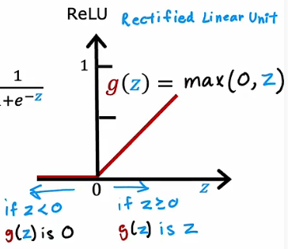  
  适用于y为非负数的场景  
  代码中实现：`activation='relu'`
- **linear**线性激活函数
  y可以既为正数也为负数  
  `activation='linear'`

### **隐藏层**激活函数的选择
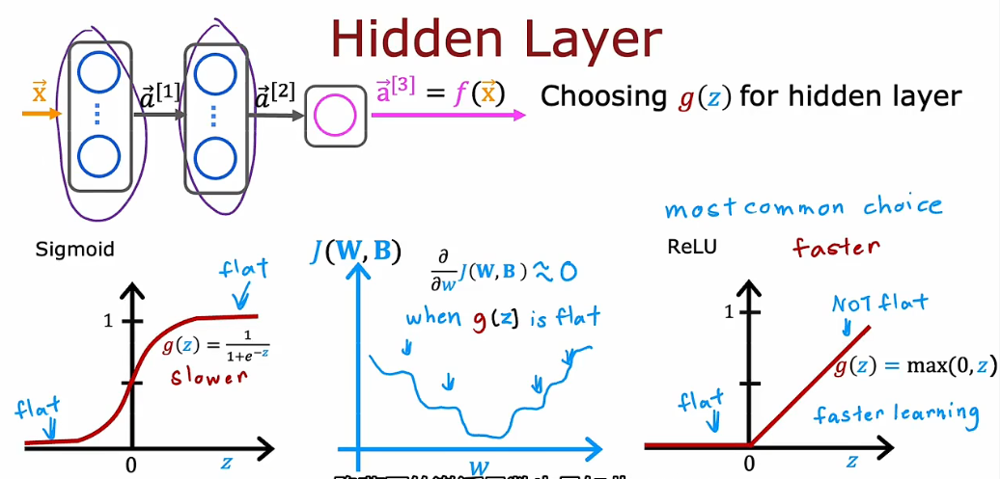   
**ReLU函数**如今在隐藏层中应用最广泛，一个是因为它的**计算速度更快**，只需要计算最大值，第二个也是最主要的原因是ReLU函数只有左边**一边是(完全)平坦的**，而sigmoid函数两边都是平坦的，这就导致后者在运用梯度下降算法训练神经网络时会很缓慢(梯度下降算法优化成本函数J(W,b)并不会优化激活函数)，减小了学习速度。

**不要在神经网络的隐藏层中使用线性激活函数**，因为线性函数在叠加之后任可以表示为线性函数的形式，意味着模型并未进行本质的改变，如果全部使用线性函数，这个模型会计算出一个完全等价于线性回归的值。

## **多分类问题**(Multi-class classification)
输出值y的种类大于2但仍是有限的离散值，而不是任何数字

### **Softmax算法**：针对多分类环境的二元分类算法

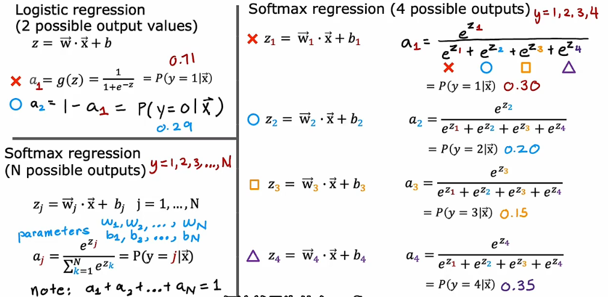  

Softmax算法成本函数的形式(密集/稀疏分类交叉熵损失函数)：
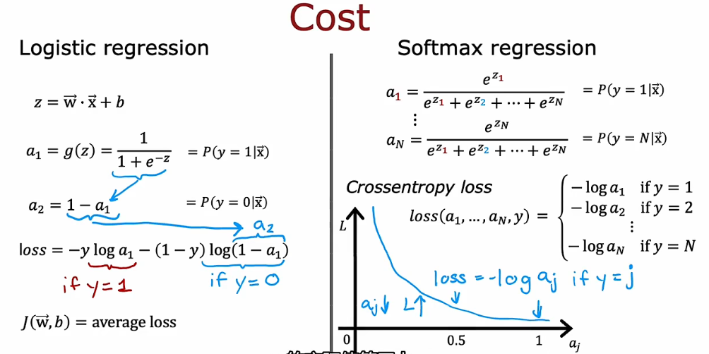  
`loss=BinaryCrossEntropy()`
实验室见：[lab_week2](Advanced_Learning_Algorithms/week2/5.Multiclass%20Classification/C2_W2_Multiclass_TF.ipynb)

### **Softmax激活函数**
因为在多分类问题中，概率值 a<sub>i</sub> 与 z<sub>1</sub>，z<sub>2</sub> ... z<sub>n</sub>均有关，每一个激活值a都取决于z的值，所以这种情况下使用softmax激活函数计算。

`activation='softmax'`

稀疏分类(sparse categorical)指的是，y仍被分成不同的类别，所以仍是分类问题，稀疏表示的是输出量y只会是给定标签类别中的一个

在代码中坚持用显式把中间量计算出来会导致数据在存储过程中存在数值舍入的末位误差。改进方法是输出层用线性激活函数，并在损失函数中设置`from_logits=True` 。这样TensorFlow会重新整理这些项，避免出现一些特别小或者特别大的中间量，从而使计算更精确。

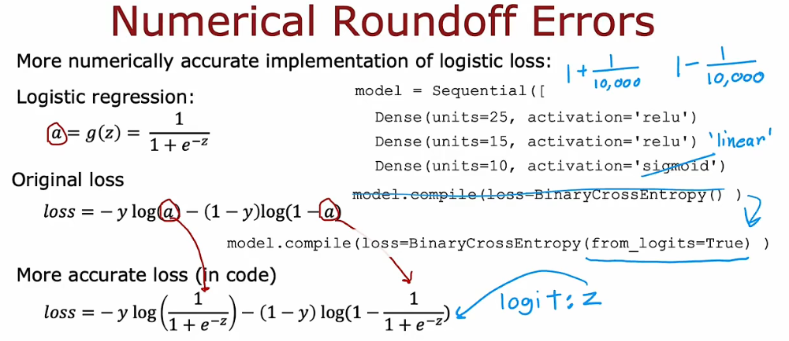  

**改进后的代码：**

```python
#model
import tensorflow as tf
from tensorflow.keras import sequential 
from tensorflow.keras.layers import Dense
model = sequential([
Dense (units=25,activation='relu')
Dense (units=15, activation='relu')
Dense (units=10, activation='linear')])  #输出层用线性激活函数
#loss
from tensorflow.keras.losses import SparseCategoricalCrossentropy
model.compile (.. . ,loss=SparseCategoricalCrossentropy (from_logits=True) )  #注意在此处的设置
#fit
model.fit (X,Y,epochs=100)
#predict
logits = model (X)  #此处输出的不是概率值a，而是z1到zn
f_x = tf.nn.softmax (logits)

```

**逻辑回归神经网络中的改进**
```python
#model
model = Sequential (
  [
      Dense (units=25, activation='sigmoid ')
      Dense(units=15,activation='sigmoid ')
      Dense (units=1, activation= 'linear ') 
  ]   
  )
from tensorflow.keras.losses import BinaryCrossentropy
#loss
model.compile (..., Binarycrossentropy (from_logits=True))
model.fit(x,Y,epochs=100)
#fit
logit = model(X)
#predict
f_x = tf.nn.sigmoid(logit)

```

实验室参考：[lab2_week2](Advanced_Learning_Algorithms/week2/5.Multiclass%20Classification/C2_W2_SoftMax-Copy1.ipynb)

## 多标签分类问题(Multi-label classification)
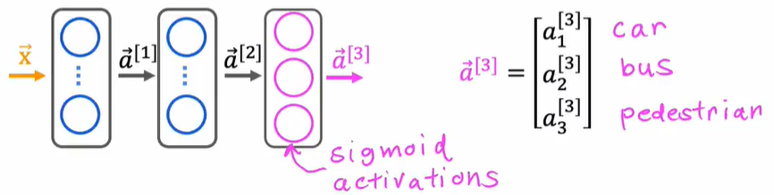  
输出的y是一个**向量**而不再是一个单一的值


 ## 高级优化算法Adam(Adaptive Moment estimation)

Adam算法中每一个参数都用的不同的学习率
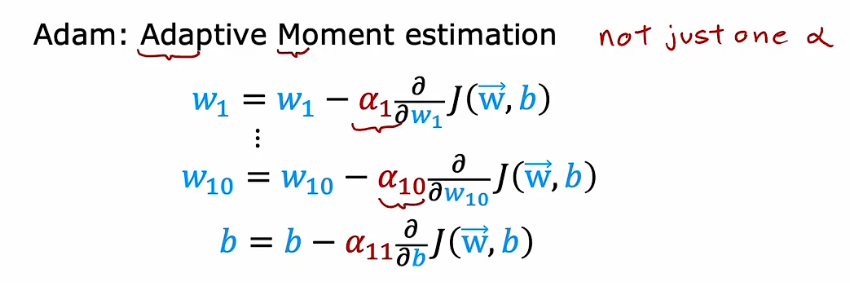 

Adam算法优化梯度下降算法的思路：
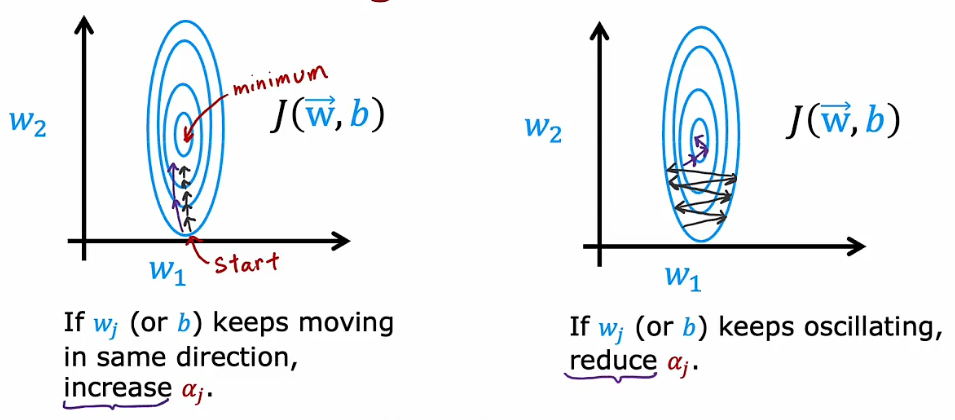 


在代码中实现Adam算法


```python
#model
model = sequential( [
tf.keras.layers. Dense (units=25,activation='sigmoid ')
tf.keras.layers. Dense (units=15,activation='sigmoid')
tf.keras.layers.Dense (units=10,activation='linear')
] )
#compile
#指定使用的优化器，指定全局学习率
model.compile (optimizer=tf.keras.optimizers.Adam(learning_rate=1e-3),  
loss=tf.keras.losses.SparseCategoricalCrossentropy(from_logits=True))
#fit
model.fit (x,r , epochs=100)

```
## 卷积层(Convolutional Layer)

不同于全连接层，卷积层每个神经元只读取前一层的部分输入值，这样设置的优点是：
1. 计算速度更快
2. 需要的训练数据更少，也不容易过度拟合

如果在神经网络中有多个卷积层，这样的神经网络有时候也叫做**卷积神经网络(Convolutional Neural Network)**

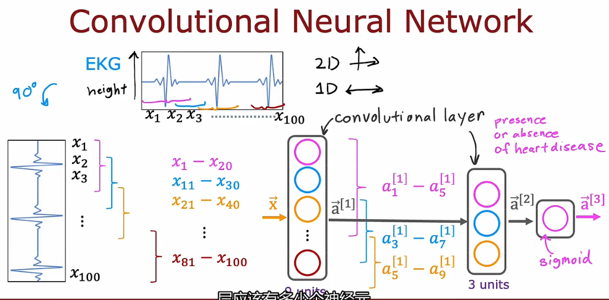  