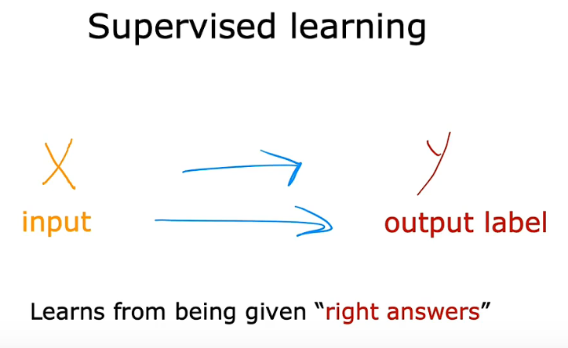
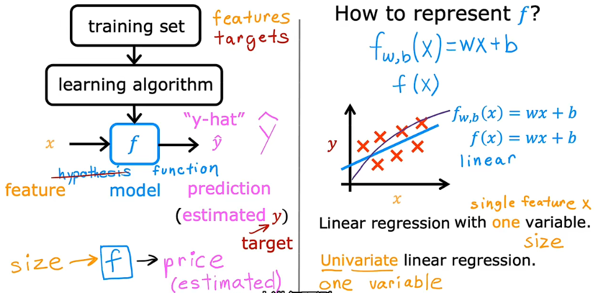
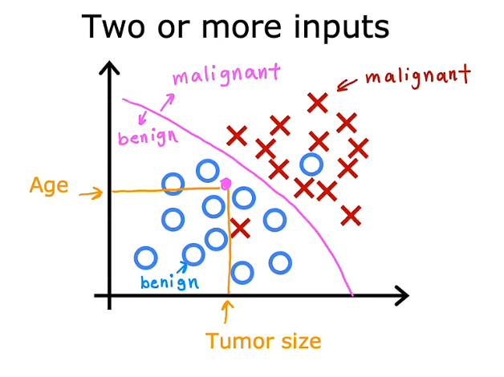
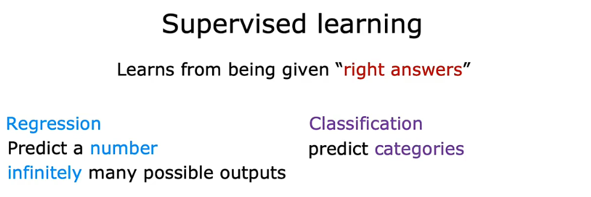
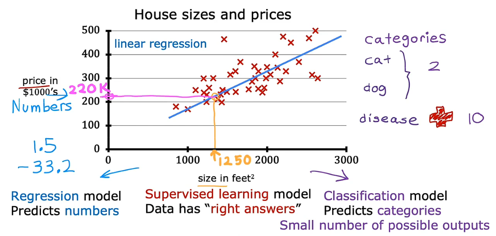
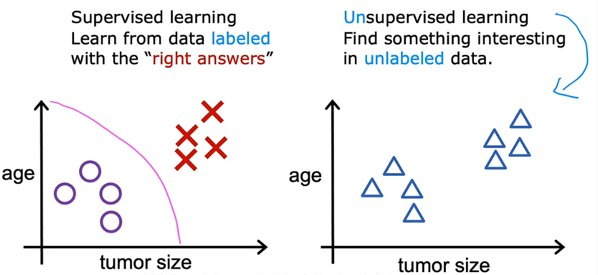
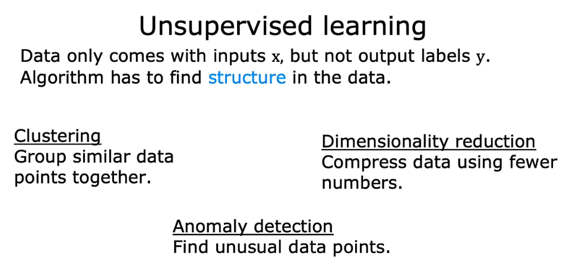

# **机器学习笔记**
**Notes during my learning ML**

机器学习的两种主要类型：
- 监督学习(Supervised learning)
使用最多的一种机器学习类型，有最快速的进步和创新。
- 无监督学习(Unsupervised learning) 
 
其他的机器学习类型：
- 强化学习(Reinforcement learning)
***
## **1.监督学习(Supervised learning)**



给算法一个数据集以及对应的正确答案，学习算法的任务是产生更多这样的正确答案。
几种监督学习算法：
- **<font size=4>1.1回归 Regression</font>**
从无限多的可能输出数字中预测数字

  - x:输入变量("input" variable/feature)
  - y:输入变量("output/target" variable)
  - m:训练样本的总数(number of training example)
  - (x,y):单个训练示例(single training example)
  - (x<sup>(i)</sup> ,y<sup>(i)</sup>):第i个训练示例(i<sup>st</sup> training example)

回归算法思路如下：

 Python 实现拟合以及训练过程详解见实验室：[optional lab](C1_W1_Lab03_Model_Representation_Soln.ipynb)

```
注:
1. 一般采用线性回归是因为线性函数简单且易使用
```


- **<font size=4>1.2分类 Classification</font>**

只有有限情况的输出类型，但可有多个输入.

- **<font size=4>1.3回归与分类的区别:</font>**
主要区别在于可能输出数据种类的多少，回归输出数据有无限种，分类只有有限种。



***
## **2.无监督学习(Unsupervised learning)**

给定的数据与任何输出标签y无关



几种无监督学习算法：

- **<font size=4>2.1聚类 Clustering</font>**

  获取没有标签的数据并尝试将它们自动分组到集群中。
- **<font size=4>2.2异常检测 Anomaly detection</font>**
- **<font size=4>2.3降维 Dimensionality reduction</font>**


I just like the feeling that I'm better than ever before.