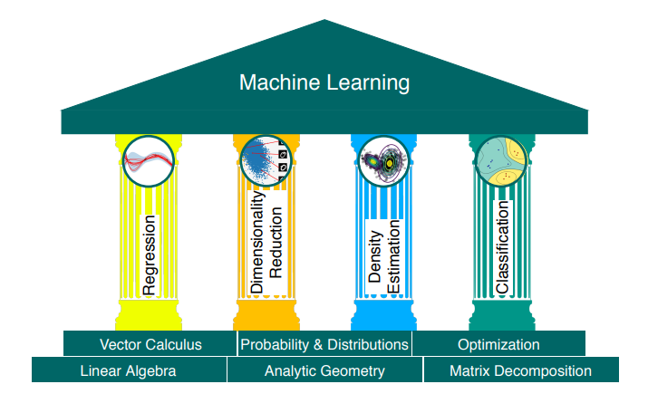
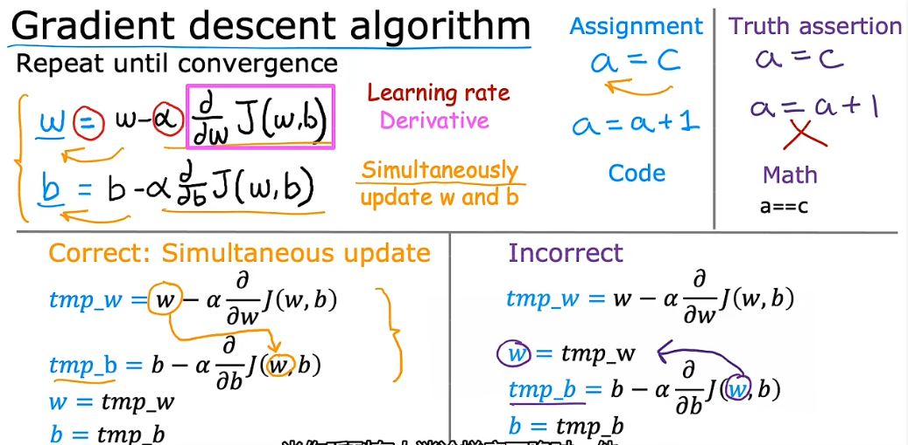
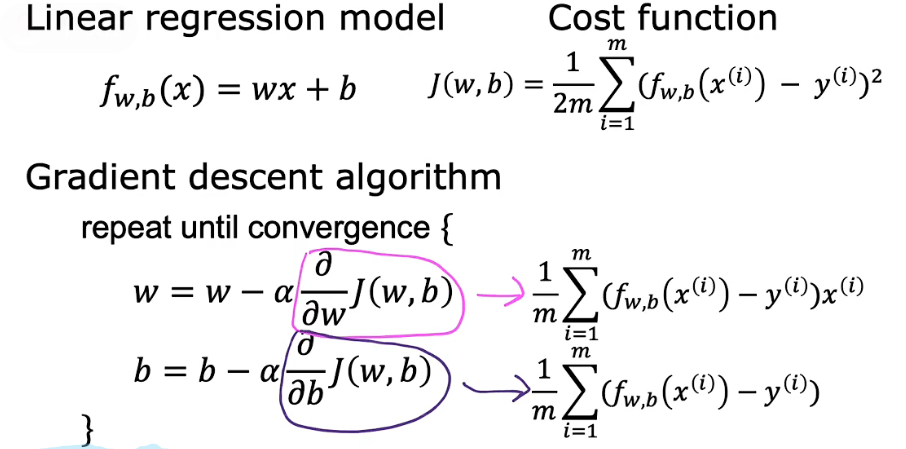
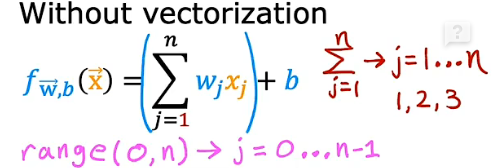
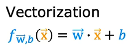
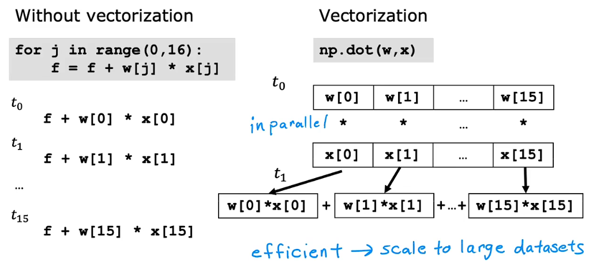
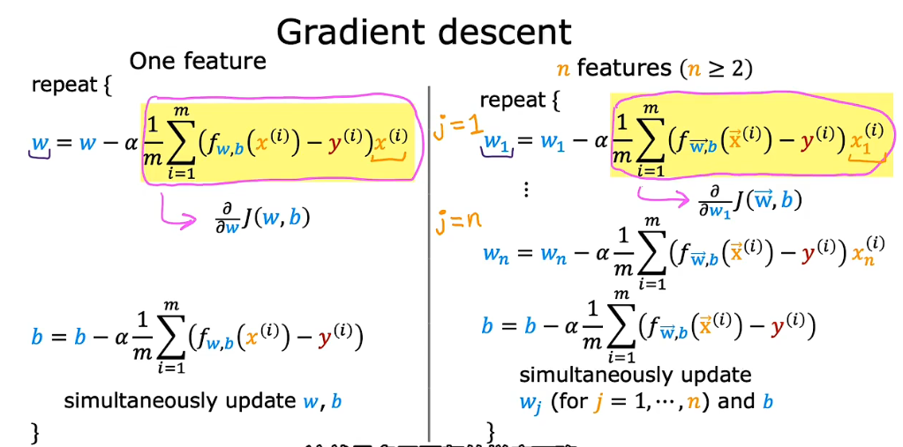
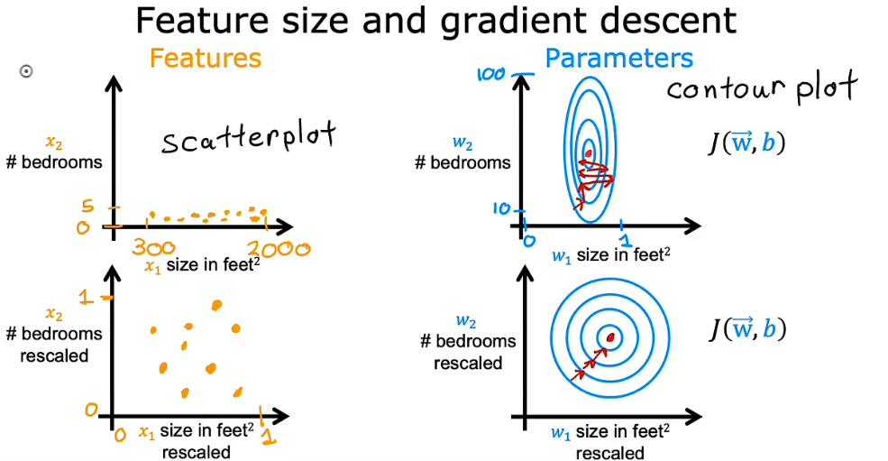

# **机器学习笔记**
**<font size=5>Notes during my learning ML</font>**

学习视频我看的是b站上的[2022吴恩达机器学习Deeplearning.ai课程](https://www.bilibili.com/video/BV1Pa411X76s/?spm_id_from=333.337.search-card.all.click)



机器学习的两种主要类型：
- **监督学习**(Supervised learning)
使用最多的一种机器学习类型，有最快速的进步和创新。
- **无监督学习**(Unsupervised learning) 
 
其他的机器学习类型：
- **强化学习**(Reinforcement learning)
***
## **1. 监督学习(Supervised learning)**


给算法一个数据集以及对应的正确答案，学习算法的任务是产生更多这样的正确答案。
几种监督学习算法：

### <font size=4>**1.1 回归 Regression**</font>

从无限多的可能输出数字中预测数字

  - x: 输入变量("input" variable/feature)
  - y: 输入变量("output/target" variable)
  - m: 训练样本的总数(number of training example)
  - (x,y): 单个训练示例(single training example)
  - (x<sup>(i)</sup> ,y<sup>(i)</sup>): 第i个训练示例(i<sup>st</sup> training example)
  - f<sub>w,b</sub>(x)=wx+b: 线性回归模型(model)
  - w,b: 模型的参数(系数/权重)(parameters)，在训练的时候改变以改进模型
  - $$J(w,b) = \frac{1}{2m} \sum\limits_{i = 0}^{m-1} (f_{w,b}(x^{(i)}) - y^{(i)})^2 $$
成本函数 Cost Function
采用误差(预测的y值与目标y<sup>(i)</sup>值之差)的平方之和除以两倍样本数


实验室中的代码实现见：[Lab04](work/C1_W1_Lab04_Cost_function_Soln.ipynb)

回归算法思路如下：

 Python 实现拟合以及训练过程详解见实验室：[lab03](work/C1_W1_Lab03_Course_Preview_Soln.ipynb)

```markdown
注:
1. 一般采用线性回归是因为线性函数简单且易使用
```

### **1.1.3 梯度下降(Gradient Descent)算法**



$\alpha$:学习率learning rate，控制学习时w和b的步长。学习率选择的不同会影响成本函数的收敛与否，直接关系到梯度下降法能否得到有效解，$\alpha$ 过大会导致发散，过小会增加迭代次数，影响学习效率。

学习率的设置:


实验室见: [lab3 week2](work2/C1_W2_Lab03_Feature_Scaling_and_Learning_Rate_Soln.ipynb)

### 1.1.4 运用平方成本函数梯度下降的**线性回归模型** 
use squared error cost function for the linear regression model with gradient deecent

实验室见：[lab05](work/C1_W1_Lab05_Gradient_Descent_Soln.ipynb)


### 1.1.5 多元线性回归 Multiple linear regression
在Python中定义数组：
```python
w = np.array([1.0,2.5,-3.3])
b = 4
x = np.array([10,20,30])
```
Python 中的数组同样从0开始，使用w数组中的第一个数的语法是 `w[0]`
循环写法：
```python
f = 0
for j in range(0,n):    #range(0,n)是从0到n-1而不是到n，这里也可以用range(n)是一样的意思
  f = f + w[j] * x[j]
f = f + b
```


Python中矢量化实现：
```python
f = np.dot(w,x) + b
```


这就相当于是数学中的点乘运算，且采用numpy中的dot运算可以大幅提高运算效率，两种代码运行原理如下所示：



具体的对比验证在week2的实验室中,的3.4.7可以找到：[lab1 week2](work2/C1_W2_Lab01_Python_Numpy_Vectorization_Soln.ipynb)

**多元回归的梯度下降**




除了梯度下降法以外，还有一种实现线性回归的方法是**正规方程法(Normal equation)**，不用迭代可以直接求出w和b，但是其只能用于线性回归，且如果训练集比较大的话，计算过程也会很慢。

多元回归模型的定义见：[lab2 week2](work2/C1_W2_Lab02_Multiple_Variable_Soln.ipynb)


### 1.1.6 特征缩放(Feature scaling)
当有不同的特征数据，且他们的取值范围非常不同时，可能会导致梯度下降运行缓慢。此时重新缩放不同的特征（对数据做类似于归一化处理），可以使数据分布较为均匀，让梯度下降的效率更高。



### **<font size=4>1.2 分类 Classification</font>**


只有有限情况的输出类型，但可有多个输入.

### **<font size=4>1.3 回归与分类的区别:</font>**

主要区别在于可能输出数据种类的多少，回归输出数据有无限种，分类只有有限种。


***
## **2.无监督学习(Unsupervised learning)**

给定的数据与任何输出标签y无关


几种无监督学习算法：


**<font size=4>2.1聚类 Clustering</font>**

  获取没有标签的数据并尝试将它们自动分组到集群中。

**<font size=4>2.2异常检测 Anomaly detection</font>**

**<font size=4>2.3降维 Dimensionality reduction</font>**


`12.17` 
> I just like the feeling that I'm better than ever before.

关于github推送，如果一次失败了的话，可以尝试解决办法有：
1. 关掉工作区重来
2. 打开代理
3. 在最上面`源代码管理储存库`中选择`推送`