# **机器学习笔记**
**<font size=5>Notes during my learning ML</font>**

学习视频我看的是b站上的[2022吴恩达机器学习Deeplearning.ai课程](https://www.bilibili.com/video/BV1Pa411X76s/?spm_id_from=333.337.search-card.all.click)

- [**机器学习笔记**](#机器学习笔记)
  - [**1. 监督学习(Supervised learning)**](#1-监督学习supervised-learning)
    - [**1.1 回归 Regression**](#11-回归-regression)
      - [**1.1.3 梯度下降(Gradient Descent)算法**](#113-梯度下降gradient-descent算法)
      - [1.1.4 运用平方成本函数梯度下降的**线性回归模型**](#114-运用平方成本函数梯度下降的线性回归模型)
      - [1.1.5 多元线性回归 Multiple linear regression](#115-多元线性回归-multiple-linear-regression)
      - [1.1.6 特征缩放(Feature scaling)与特征工程(Feature engineering)](#116-特征缩放feature-scaling与特征工程feature-engineering)
      - [1.1.7 多项式回归](#117-多项式回归)
    - [**1.2 分类 Classification**](#12-分类-classification)
      - [**1.2.1 逻辑回归(Logistic regression)**](#121-逻辑回归logistic-regression)
      - [**1.2.2 逻辑回归损失函数(Logistic loss function)**](#122-逻辑回归损失函数logistic-loss-function)
      - [**1.2.3 逻辑回归的梯度下降法(Graduent descent for logistic regression)**](#123-逻辑回归的梯度下降法graduent-descent-for-logistic-regression)
    - [1.3 回归与分类的区别:](#13-回归与分类的区别)
    - [**1.4 过拟合问题与正则化**](#14-过拟合问题与正则化)
      - [1.4.1 欠拟合(Underfitting)与过拟合(Overfitting)](#141-欠拟合underfitting与过拟合overfitting)
      - [**1.4.2 正则化 (Regularization)**](#142-正则化-regularization)
  - [**2. 无监督学习(Unsupervised learning)**](#2-无监督学习unsupervised-learning)
    - [**2.1 聚类 Clustering**](#21-聚类-clustering)
    - [**2.2 异常检测 Anomaly detection**](#22-异常检测-anomaly-detection)
    - [**2.3 降维 Dimensionality reduction**](#23-降维-dimensionality-reduction)
  - [**3.改进模型**](#3改进模型)
    - [3.1 对训练结果进行评估](#31-对训练结果进行评估)
    - [3.2 **交叉验证集**(Cross validation set)](#32-交叉验证集cross-validation-set)
    - [3.3 偏差(bias)与方差(variance)及其含义](#33-偏差bias与方差variance及其含义)


机器学习的两种主要类型：
- **监督学习**(Supervised learning)
使用最多的一种机器学习类型，有最快速的进步和创新。
- **无监督学习**(Unsupervised learning) 
 
其他的机器学习类型：
- **强化学习**(Reinforcement learning)
***
## **1. 监督学习(Supervised learning)**


给算法一个数据集以及对应的正确答案，学习算法的任务是产生更多这样的正确答案。
几种监督学习算法：

### <font size=4>**1.1 回归 Regression**</font>

从无限多的可能输出数字中预测数字

  - x: 输入变量("input" variable/feature)
  - y: 输入变量("output/target" variable)
  - m: 训练样本的总数(number of training example)
  - (x,y): 单个训练示例(single training example)
  - (x<sup>(i)</sup> ,y<sup>(i)</sup>): 第i个训练示例(i<sup>st</sup> training example)
  - f<sub>w,b</sub>(x)=wx+b: 线性回归模型(model)
  - w,b: 模型的参数(系数/权重)(parameters)，在训练的时候改变以改进模型
  - $$J(w,b) = \frac{1}{2m} \sum\limits_{i = 0}^{m-1} (f_{w,b}(x^{(i)}) - y^{(i)})^2 $$
成本函数 Cost Function
采用误差(预测的y值与目标y<sup>(i)</sup>值之差)的平方之和除以两倍样本数


实验室中的代码实现见：[Lab04](work/C1_W1_Lab04_Cost_function_Soln.ipynb)

>回归算法思路如下：


 Python 实现拟合以及训练过程详解见实验室：[lab03](work/C1_W1_Lab03_Course_Preview_Soln.ipynb)

```markdown
注:
1. 一般采用线性回归是因为线性函数简单且易使用
```

#### **1.1.3 梯度下降(Gradient Descent)算法**


$\alpha$:学习率learning rate，控制学习时w和b的步长。学习率选择的不同会影响成本函数的收敛与否，直接关系到梯度下降法能否得到有效解,$\alpha$ 过大会导致发散，过小会增加迭代次数，影响学习效率。

>**学习率的设置**:


实验室见: [lab3 week2](work2/C1_W2_Lab03_Feature_Scaling_and_Learning_Rate_Soln.ipynb)

#### 1.1.4 运用平方成本函数梯度下降的**线性回归模型** 
use squared error cost function for the linear regression model with gradient deecent

实验室见：[lab05](work/C1_W1_Lab05_Gradient_Descent_Soln.ipynb)


#### 1.1.5 多元线性回归 Multiple linear regression
在Python中定义数组：
```python
w = np.array([1.0,2.5,-3.3])
b = 4
x = np.array([10,20,30])
```
Python 中的数组同样从0开始，使用w数组中的第一个数的语法是 `w[0]`
循环写法：
```python
f = 0
for j in range(0,n):    #range(0,n)是从0到n-1而不是到n，这里也可以用range(n)是一样的意思
  f = f + w[j] * x[j]
f = f + b
```


Python中矢量化实现：
```python
f = np.dot(w,x) + b
```


>这就相当于是数学中的点乘运算，且采用numpy中的dot运算可以大幅提高运算效率，两种代码运行原理如下所示：
> 

具体的对比验证在week2的实验室中,的3.4.7可以找到：[lab1 week2](work2/C1_W2_Lab01_Python_Numpy_Vectorization_Soln.ipynb)

**多元回归的梯度下降**

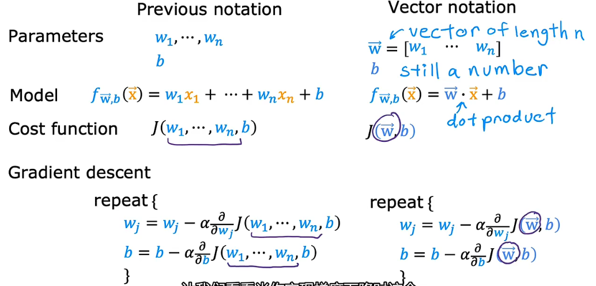


除了梯度下降法以外，还有一种实现线性回归的方法是**正规方程法(Normal equation)**，不用迭代可以直接求出w和b，但是其只能用于线性回归，且如果训练集比较大的话，计算过程也会很慢。

多元回归模型的定义见：[lab2 week2](work2/C1_W2_Lab02_Multiple_Variable_Soln.ipynb)


#### 1.1.6 特征缩放(Feature scaling)与特征工程(Feature engineering)
**特征缩放**：当有不同的特征数据，且他们的取值范围非常不同时，可能会导致梯度下降运行缓慢。此时重新缩放不同的特征（对数据做类似于归一化处理），可以使数据分布较为均匀，让梯度下降的效率更高。


**特征工程**：通过你个人对问题的理解以及直觉，对原始的数据进行相关变换得到新的数据，再进行机器学习。


#### 1.1.7 多项式回归

Scikit-learn：一个广泛使用的开源机器学习库
多项式回归在实验室中的实现：[lab4 week2](work2/C1_W2_Lab04_FeatEng_PolyReg_Soln.ipynb)

### **<font size=4>1.2 分类 Classification</font>**


只有有限情况的输出类型，但可有多个输入.

#### **1.2.1 逻辑回归(Logistic regression)**
 $$f_{\mathbf{w},b}(\mathbf{x}^{(i)}) = g(\mathbf{w} \cdot \mathbf{x}^{(i)} + b)$$
> 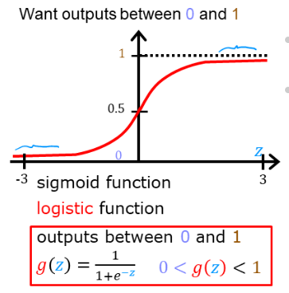 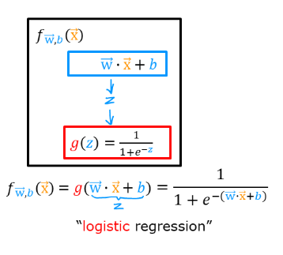

逻辑回归与线性回归根本的不同还是在于使用函数f<sub>w,b</sub>(x)的不同：逻辑回归中使用的Sigmod函数(用g(z)： $g(z) = \frac{1}{1+e^{-z}}$ 来表示，其中z=wx+b或者其他训练数据)，能够对输出仅是0和1的情况更好地拟合。实验室见[lab2 week3](work3/C1_W3_Lab02_Sigmoid_function_Soln.ipynb)

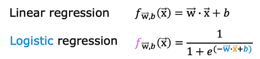

代码中对sigmoid()函数定义如下：
```python
def sigmoid(z):
    """
    Compute the sigmoid of z

    Args:
        z (ndarray): A scalar, numpy array of any size.

    Returns:
        g (ndarray): sigmoid(z), with the same shape as z
         
    """

    g = 1/(1+np.exp(-z))
   
    return g
```
**决策边界(Decision boundary)**

决策边界相当于是  $f_{\mathbf{w},b}(\mathbf{x}) = g(\mathbf{w} \cdot \mathbf{x} + b)$
中 $\mathbf{z}=\mathbf{w} \cdot \mathbf{x} + b=0$

实验室中的代码实现：[lab3 week3](work3/C1_W3_Lab03_Decision_Boundary_Soln.ipynb)

#### **1.2.2 逻辑回归损失函数(Logistic loss function)**

线性回归中的代价函数在逻辑回归中无法适用，所以要构成一个新的成本函数。
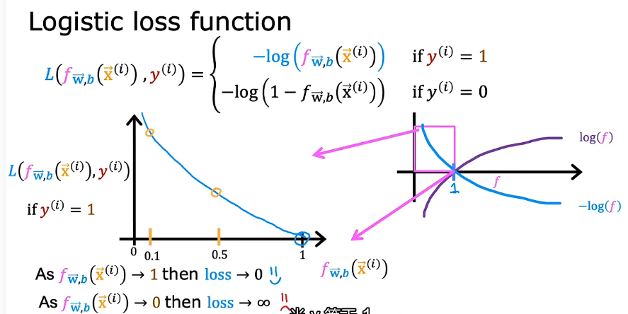
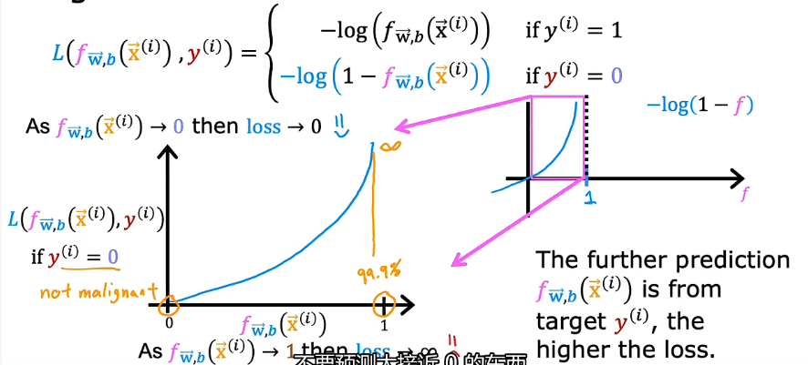

实验室见：[lab4 week3](work3/C1_W3_Lab04_LogisticLoss_Soln.ipynb),有比较详细的讲述。

The loss function above can be rewritten to be easier to implement.

$$loss(f_{\mathbf{w},b}(\mathbf{x}^{(i)}), y^{(i)}) = (-y^{(i)} \log\left(f_{\mathbf{w},b}\left( \mathbf{x}^{(i)} \right) \right) - \left( 1 - y^{(i)}\right) \log \left( 1 - f_{\mathbf{w},b}\left( \mathbf{x}^{(i)} \right) \right)$$

#### **1.2.3 逻辑回归的梯度下降法(Graduent descent for logistic regression)**

成本函数即为代价函数之和取平均：

$$ J(\mathbf{w},b) = \frac{1}{m} \sum_{i=0}^{m-1} \left[ loss(f_{\mathbf{w},b}(\mathbf{x}^{(i)}), y^{(i)}) \right] $$

成本函数相关代码见实验室：[lab5 week3](work3/C1_W3_Lab05_Cost_Function_Soln.ipynb)

其他的在线性回归中使用的关于梯度下降的方法例如**矢量化**实现和**特征缩放** 等方法在逻辑回归中同样适用。实验室中关于逻辑回归的梯度下降法有介绍：[lab6 week3](work3/C1_W3_Lab06_Gradient_Descent_Soln.ipynb)


### <font size=4>1.3 回归与分类的区别:</font>

主要区别在于可能输出数据种类的多少，回归输出数据有无限种，分类只有有限种。


>  

### <font size=4>**1.4 过拟合问题与正则化**</font>

#### 1.4.1 欠拟合(Underfitting)与过拟合(Overfitting)
>线性回归中的欠拟合和过拟合：
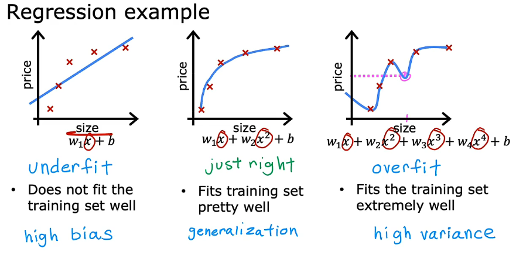

>逻辑回归中的欠拟合与过拟合
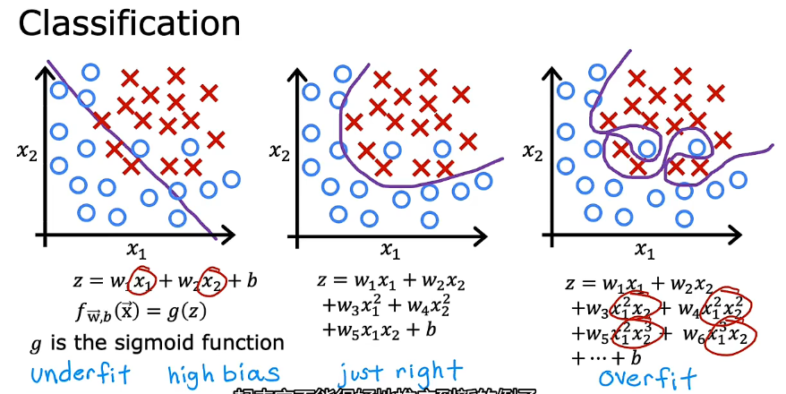

欠拟合存在高偏差(high bias)，而过拟合存在高方差(high variance)。
机器学习的目标是找到一个既不过拟合也不欠拟合的模型。
解决过拟合的方法有：
1. 获得更多的训练数据：缺点是有的时候数据数量有限或者无法获得更多的数据。
2. **特征选择**：选择与预测结果最相关的一组特征值(原特征的子集)进行训练，减少使用的多项式特征(x<sub>(i)</sub>)的数量。但是这个方法的缺点是会丢失某些信息。
3. **正则化(Regularization)**：减小特征参数w<sub>(j)</sub>的值来实现保留所有特征的同时防止多余的特征产生过大的影响(过拟合)。

>过拟合的实验室演示见：[lab8 week3](work3/C1_W3_Lab08_Overfitting_Soln.ipynb)


#### **1.4.2 正则化 (Regularization)**
***
**1.正则化在线性回归中的应用**：

The equation for the cost function regularized linear regression is:

$$J(\mathbf{w},b) = \frac{1}{2m} \sum\limits_{i = 0}^{m-1} (f_{\mathbf{w},b}(\mathbf{x}^{(i)}) - y^{(i)})^2  + \frac{\lambda}{2m}  \sum_{j=0}^{n-1} w_j^2$$ 

$\lambda$ :正则化参数(Regularization parameter)($\lambda>0$)

>正则化在每次迭代中所做的就是将系数w乘以一个比1略小的数字从而保证w有一定的收缩的作用。 
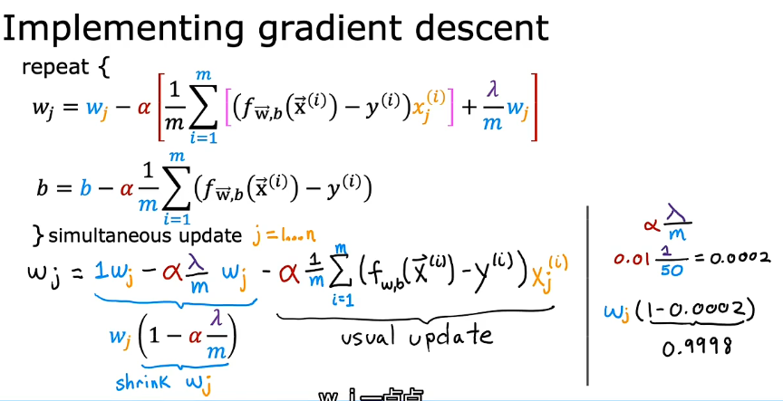

**2.正则化在逻辑回归中的应用**：

For regularized **logistic** regression, the cost function is of the form

$$J(\mathbf{w},b) = \frac{1}{m}  \sum_{i=0}^{m-1} \left[ -y^{(i)} \log\left(f_{\mathbf{w},b}\left( \mathbf{x}^{(i)} \right) \right) - \left( 1 - y^{(i)}\right) \log \left( 1 - f_{\mathbf{w},b}\left( \mathbf{x}^{(i)} \right) \right) \right] + \frac{\lambda}{2m}  \sum_{j=0}^{n-1} w_j^2$$

***
## **2. 无监督学习(Unsupervised learning)**

给定的数据与任何输出标签y无关


几种无监督学习算法：


### **<font size=4>2.1 聚类 Clustering</font>**

  获取没有标签的数据并尝试将它们自动分组到集群中。

### **<font size=4>2.2 异常检测 Anomaly detection</font>**

### **<font size=4>2.3 降维 Dimensionality reduction</font>**


## **3.改进模型**
1. 获得更多的训练数据
2. 用更小的特征集
3. 添加新的特征
4. 增加现有特征的多项式组合
5. 减小正则化参数 $\lambda$
6. 增大正则化参数 $\lambda$

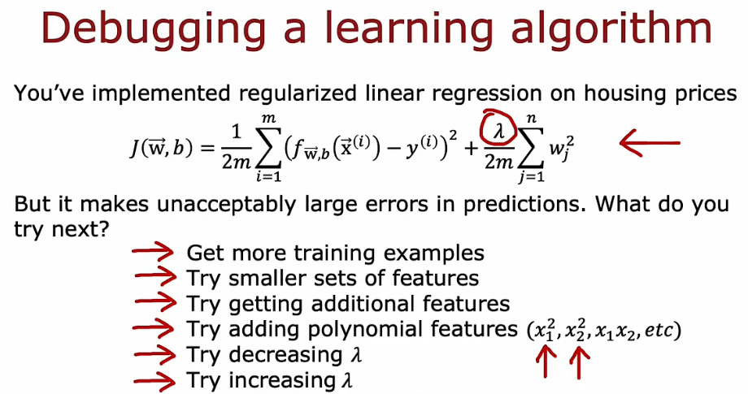

### 3.1 对训练结果进行评估

**带有误差代价平方的回归(Regression with squared error cost)**

将原始样本数据分成两份，一份用于训练，另一份用来测试模型，通过衡量J_test和J_train，可以衡量模型在测试集和训练集上的表现.

>将原始样本数据分成几份(训练集，交叉验证集，测试集)：

| data             | % of total | Description |
|------------------|:----------:|:---------|
| training         | 60         | Data used to tune model parameters $w$ and $b$ in training or fitting |
| cross-validation | 20         | Data used to tune other model parameters like degree of polynomial, regularization or the architecture of a neural network.|
| test             | 20         | Data used to test the model after tuning to gauge performance on new data |


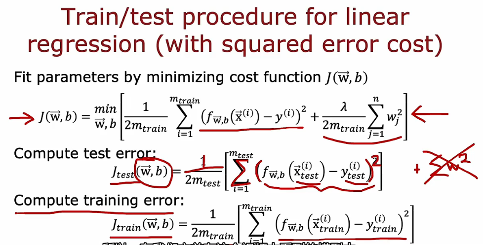

测试误差的计算式：
> $$ J_\text{test}(\mathbf{w},b) = 
>            \frac{1}{2m_\text{test}}\sum_{i=0}^{m_\text{test}-1} ( f_{\mathbf{w},b}(\mathbf{x}^{(i)}_\text{test}) - y^{(i)}_\text{test} )^2 $$  


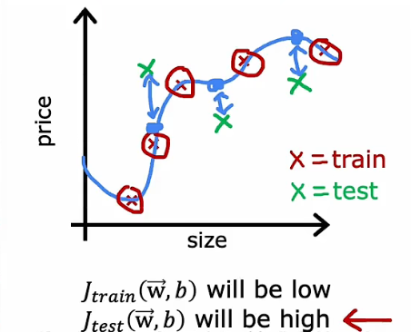


**带有误差代价平方的分类模型**  
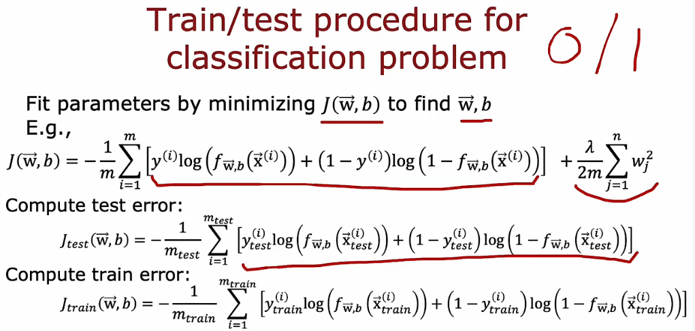

实验室见deep Learning文件夹中的 [lab3 week3](../Deeplearning/Advanced_Learning_Algorithms/week3/work/C2_W3_Assignment.ipynb)

### 3.2 **交叉验证集**(Cross validation set) 
>|| **选择合适的模型** :  
>当J_test最小时选出多项式d，所以当使用这个d时J_test就会小，但要是在新的测试集上可能J又会大。  
>训练集用来训练参数w和b，而测试集用来选择多项式模型（即参数d），训练集不能评估w和b的好坏，类似的测试集也不能用来评估参数d的好坏

因此，单靠测试集和训练集无法准确地选出最合适的模型。

**交叉验证集**是一个额外的数据集，用来检查或信用检查(trust check)不同模型的有效性和准确性。也被简称为验证集(validation set)或开发集(development/dev set)
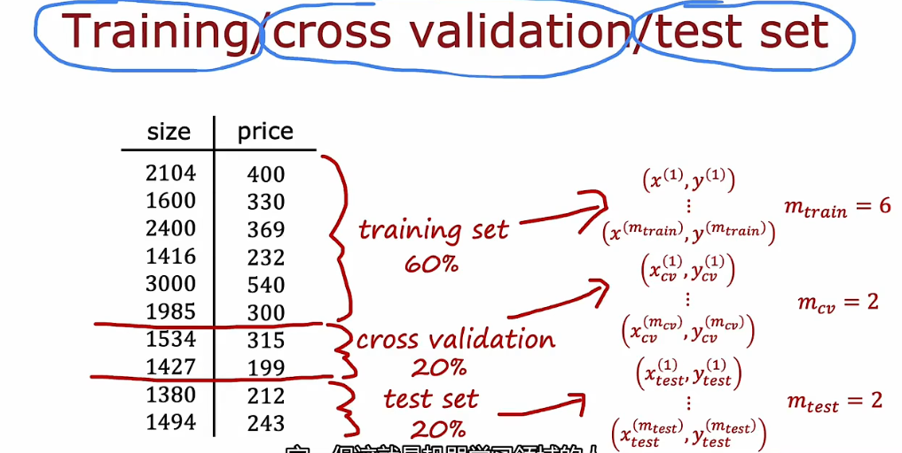

>训练误差，交叉验证误差和测试误差
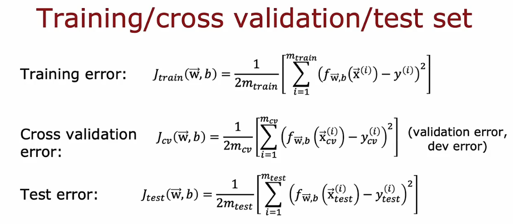

观察哪个模型具有最低的交叉验证错误

>基于交叉验证误差的模型选择
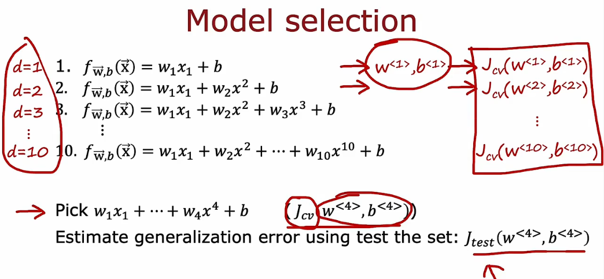

>用于神经网络模型选择
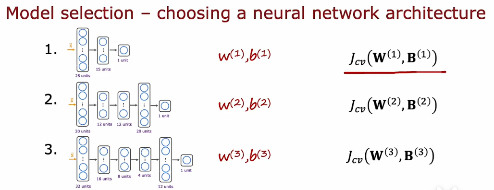

>交叉验证误差用来选择模型的形式(多项式的形式或者神经网络的层数等)，训练误差用来确定模型的参数，泛化误差(generalization)的估计值用测试集来估计选择的模型的性能。  
>相当于决定模型只看训练集和交叉验证集，不用测试集，并且测试集用在做完了这些决定之后，这样的好处可以确保没有不小心往测试集里添加内容，这样测试集就会变得很公平(因为你没有提前偷看‘考试答案’，没有用测试集做任何决定)，而不是对泛化误差过度乐观估计。

### 3.3 偏差(bias)与方差(variance)及其含义
之前在[欠拟合与过拟合](#141-欠拟合underfitting与过拟合overfitting)中我们知道：欠拟合存在高偏差(high bias)，而过拟合存在高方差(high variance)。现在，也可以通过计算**J_train**和**J_cv**，即使我们不画出函数f，也可以大概估计出算法是否有高偏差或者高方差。

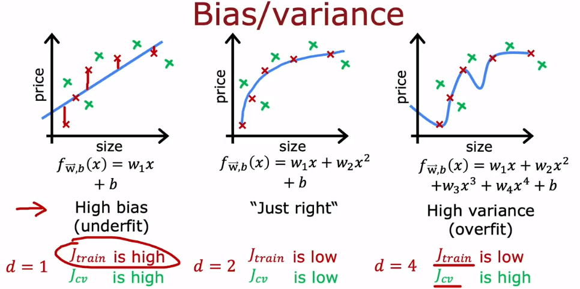  

**高偏差**意味着算法在**训练集上表现不好**，**高方差**意味着算法在**交叉验证集的表现比训练集上的差得多**

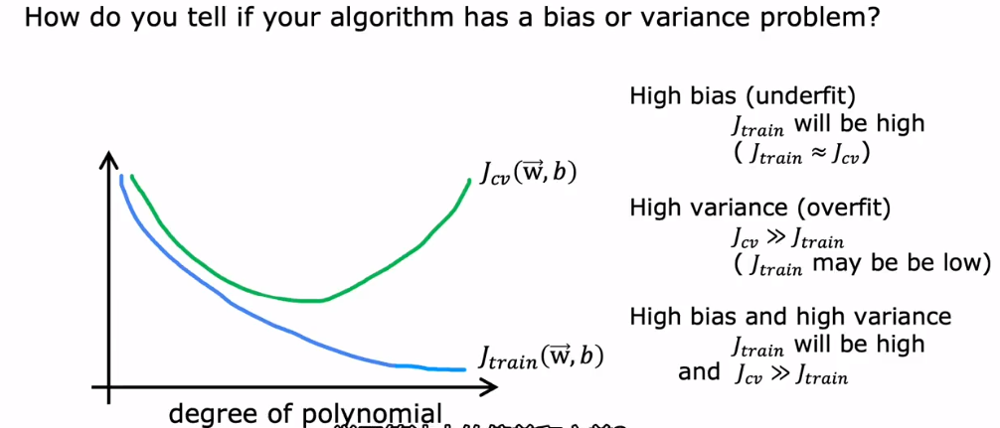


***
***
关于github推送，如果一次失败了的话，可以尝试解决办法有：
1. 关掉**工作区**重来
2. 打开代理
3. 在最上面`源代码管理储存库`中选择`推送`


`12.17` 
> I just like the feeling that I'm better than ever before.